# Skein：架构与运行契约

[源码与用法](../README.md) · [完整 DDL](../migrations/) · [性能基线](baseline.md) · [场景验收](scenarios.md)

## 1. 架构与模型

### 1.1 进程与职责

要求 PostgreSQL ≥13。

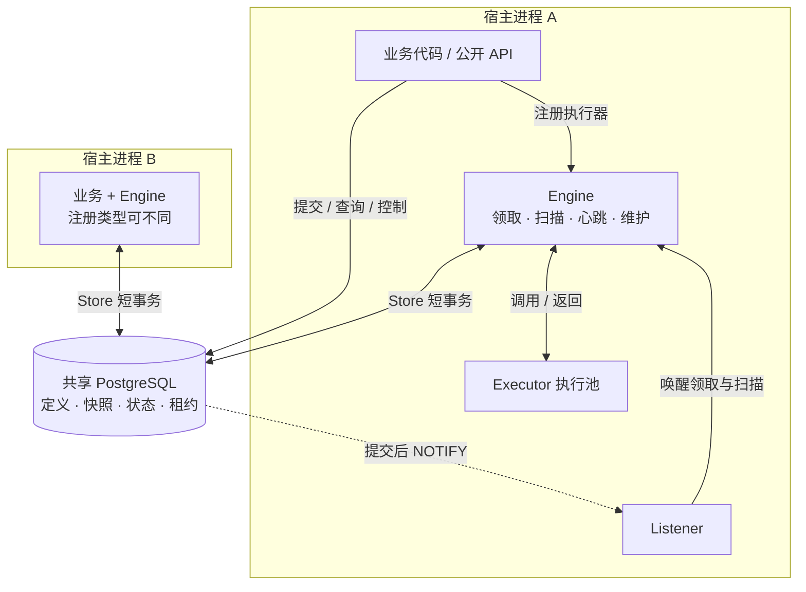

- **实例对等**：没有选主、额外调度服务或外部队列。只领本实例注册的类型；不兼容任务留在队列。
- **状态只在 PG**：`job_run` 同时是队列、租约与记录，工作流节点也用它。
- **执行不占连接**：Concurrency 是每进程槽位。宿主拥有池；Listener 另占一条 Hijack 连接，Engine 不关闭宿主池。

| 不另建的循环 | 由谁完成 |
|---|---|
| 僵尸清扫 | 领取分支二接管过期租约 |
| 工作流推进 | 节点结算事务 |
| 超时扫描 | Executor ctx deadline + 租约上限 |

| 进程开关 | 关闭范围 |
|---|---|
| DisableWorker | 领取、执行 |
| DisableScheduler | 计划扫描、维护 |
| 两者都关 | 只提交 / 查询 / 控制，不启动监听 |

**包边界**：根包 → [Store](../internal/store/) / migrations，不反向导入。根包只调用 Store 事务方法，不拼 Queries；生成行类型止于根包映射函数。[源码导航](../README.md#源码导航)

### 1.2 数据关系与快照

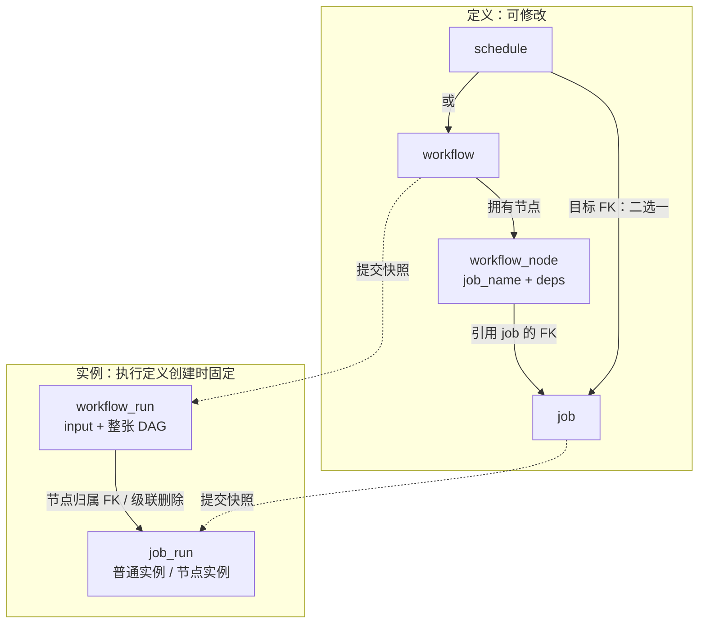

虚线是**创建时复制，不是 FK**。被引用的定义不能删；实例与定义无 FK，删除定义不删除历史、不改变执行快照。计划拍的创建与 Resume 按当前重叠规则准入（§2.1）。

| 固定在哪里 | 内容与理由 |
|---|---|
| job_run | executor_type、params、timeout、retry_policy；执行 / 重试 / 恢复 / Resume 共用快照 |
| workflow_run | 整张 DAG；推进与续跑本来就锁父行，不逐节点复制 deps |
| workflow_node | deps 数组；无反向依赖查询，保存时校验引用与无环，无需边表 |
| schedule | 时间规则、时区、启停、重叠策略与 next_run_at；恰好一个目标，不带参数覆盖 |

一个 job 在一个工作流中最多出现一次。Executor 的输入来源见 §3.1。

| 字段 | 只表达什么 |
|---|---|
| run_at / lease_expires_at | pending 到期 / running 租约到期，不能混用 |
| lease_token / extra.lease_owner | 随机 UUID 持租凭证 / 排障标识；只有 token 参与 fence |
| started_at | 当前这次执行的开始，不是整个 run 历时 |
| attempt / errors / output | 失败与中断计数 / 追加历史 / 成功结果；不另拆 attempts 表 |

`job_run.extra` 与 `workflow_run.extra` 是库管理的 JSON 对象，默认 `{}`。普通实例保存提交时的追踪传播字段；工作流只在父实例保存，节点执行时随父输入读取（§3.5）。`lease_owner` 属于节点或普通实例自身的 extra；领取替换、清租约删除此键，保留其它元数据。`cancel_requested` 仍为独立列，参与取消守卫。

### 1.3 存储约束与索引

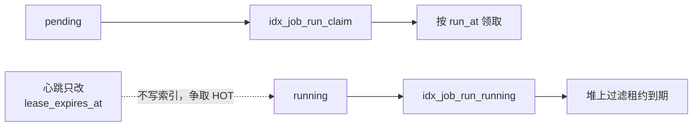

两支都按 executor_type 限定候选，必须独立；`FOR UPDATE` 不能作用于 `UNION`。完整列、CHECK、索引与触发器见 [DDL](../migrations/)。

| 数据库守卫 | 依赖它的性质 |
|---|---|
| running ⇔ 有租约 | token / expires_at 非空且 extra.lease_owner 为 JSON 字符串；无租约时 owner 键必须不存在，不能是 JSON null |
| extra 是非 NULL JSON 对象 | 元数据不参与领取、排序与去重，不新增索引 |
| 终态 ⇔ finished_at 非空 | 非终态不带完成时间；只有节点允许 blocked |
| 去重键部分唯一索引 | 普通按 job_name、工作流按 workflow_name，与 dedup_key 联合唯一。仅扫描器写 schedule_name；按其 NULL / 非 NULL 分用户键 / skip 拍两条互斥索引，用户键不看 state，skip 拍限在途（§2.1） |
| 节点无 dedup_key；计划拍次唯一 | 节点由父实例占位；拍次由 `(schedule_name, scheduled_at)` 兜底 |
| 节点、FK、列表及保留索引 | 列表按 id 排序；created_at 与并发插入顺序不保证一致。历史用 finished_at 范围，节点随父清理 |

**HOT 的取舍**

| 选择 | 理由 / 代价 |
|---|---|
| lease_expires_at 不入索引 | 心跳不动索引；代价是独立的 running 领取分支 |
| toast_tuple_target=256、fillfactor=70 | 大 jsonb 出主行，同页给版本链留空间；代价是堆空间 |
| finished_at 范围索引 | 结算时才写入，同一范围服务两种保留窗口；BRIN 受删后页面复用影响 |

当前去重唯一索引不含分区键，不能直接分区。HOT 验收见 [README](../README.md#验证判据)。

**schema 与迁移**

| 边界 | 必须做到 |
|---|---|
| 库事务，包括读取 | `Store.tx` 设置事务局部 `search_path = quoted(schema), pg_temp`；无前缀查询，不在连接 / 池层设置 |
| pg_temp 显式在后 | 防止宿主同名临时表抢先接走库查询 |
| schema 输入 | New / Migrate 共用校验：空值取默认，其余须为有效 UTF-8、无 NUL 且不超过 63 字节；拒绝静默改写或截断导致的命名空间别名 |
| TriggerTx | 保存、临时设置、恢复调用方路径；恢复用脱离调用方取消的独立 5s ctx |
| 恢复失败 | 单独返回，不能被 ErrDuplicate 掩盖；调用方事务不再可信 |
| 计划名称锁 | `(schema, schedule_name)` 派生事务级 advisory lock，Put / Delete / 扫描 / 计划拍 Resume 共用；不依赖 schedule 行存在，提交或回滚释放。与迁移及维护锁区分命名空间；哈希冲突只扩大串行范围 |
| Migrate → Start | 宿主显式迁移；数据库共享固定键的事务级 advisory lock 串行整个迁移，含建 schema（IF NOT EXISTS 本身不原子）。各 schema 记版本，已执行版本不重放；Start 仅校验版本相等，不检查索引定义；无 down migration |

## 2. 运行协议

**共同前提**：READ COMMITTED；Store 方法各自开始 / 提交 / 回滚；跨行不变量靠锁、条件 UPDATE 和唯一索引。SQL 比较使用 DB 时间。

### 2.1 提交与计划触发

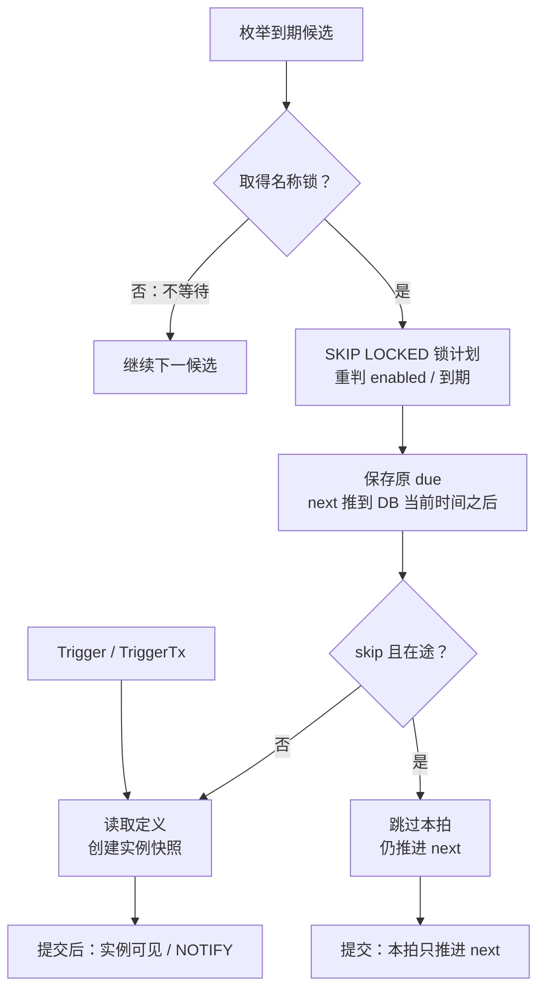

图按一次提交 / 一个计划描述；扫描在对应批次事务中。跳过的本拍不产生通知，同批其它建 run 不受影响。

扫描按 `(next_run_at, name)` 游标分段枚举，越过锁竞争候选；每批至多实际处理 50 个计划，Full 只按实际推进 / 禁用数判断。名称锁取得后才锁计划行；全批提交前不释放，取得额外名称锁不得等待。未锁到的计划不推进、不计 overlap 跳拍。

| 入口 | 创建与确认 |
|---|---|
| 普通 Trigger | 一条 INSERT…SELECT；浅合并 params，同名键由调用方覆盖；At 只改变 run_at |
| 工作流 Trigger | 一个事务写 input / DAG 父快照，并将已读取的全部节点快照批量写入：无依赖 pending，其余 blocked；避免逐节点网络往返耗尽扫描预算，不重读定义 |
| TriggerTx | 与宿主业务共用事务，只有宿主 Commit 才确认；不发本地唤醒，提交触发器负责通知 |
| 扫描 | 建 run 时保存 schedule_name、scheduled_at=原 due；错过多拍只补一拍 |

**去重，不另管占位表**

| 键 | 范围 | 理由 |
|---|---|---|
| 用户 DedupKey | 保留窗口内唯一，不看 state | 幂等需覆盖历史，而非只防重叠 |
| overlap=skip 的 `sched:<name>` | 在途唯一，终态释放 | 重叠是在途属性：上一拍结束后下一拍必须能建 |

**当前 skip 规则**：持名称锁，跨 `job_run` / `workflow_run` 检查同 `schedule_name` 的全部在途拍，包含历史 allow 的 NULL 键和旧目标；Resume 排除自身。存在其它拍时，扫描推进 next 并记 skipped，Resume 返回 ErrDuplicate 且回滚。已有 dedup_key / 唯一约束仍保留，不转换历史键。

Put 可将 allow 改成 skip，已在途拍继续；新拍与 Resume 才受新规则约束。删除计划后，历史 Resume 仍持名称锁并遵循原唯一约束；同名重建视为该名称的延续，旧在途拍参与新 skip 检查。Put / Delete 每次只锁一个名称。准入查询不锁其它 run；结算只移出在途集合，读到其提交前状态最多多跳一拍。

| INSERT / 查找结果 | 返回或继续 |
|---|---|
| 定义不存在 | ErrNotFound |
| 撞键、找到持有者 | 已有 id + ErrDuplicate；用户键的持有者可以是终态 |
| 撞键后持有者已消失 | 用户键：清理恰好删掉；skip 拍：上一拍恰好结束。重试 INSERT，最多 3 轮；耗尽允许 `(0, ErrDuplicate)` |
| 无 dedup_key 的固定拍次冲突 | 零 id + ErrDuplicate |

普通与工作流均用无目标 `ON CONFLICT DO NOTHING`；同键不同 params 不合并、不更新已有快照。唯一冲突不撤销同批事实，瞬时 DB 错误则整批回滚。

**计划时间边界**

| 情况 | 处理 / 理由 |
|---|---|
| 重复 Put | 先取 DB now()；仅 cron / timezone 变化或重新启用才改 next，避免发布不断推迟触发 |
| 扫描推进 | 不改 updated_at；满 50 行立即再扫，未满在批末读下次到点 |
| DST | 只用 Timezone；缺失本地时刻不触发，回拨的不同 UTC 拍次各自处理 |
| 无下一拍 | Put 拒绝；扫描时禁用、不建 run，记 error 与 `schedule_skipped_total{reason="no_next"}` |
| cron 搜索 | robfig 窗口 5 年；日与星期同时指定是 OR，不是 AND |

不能用宿主慢钟求 next，否则可能退回原 due，反复撞同拍唯一索引。

### 2.2 领取与执行

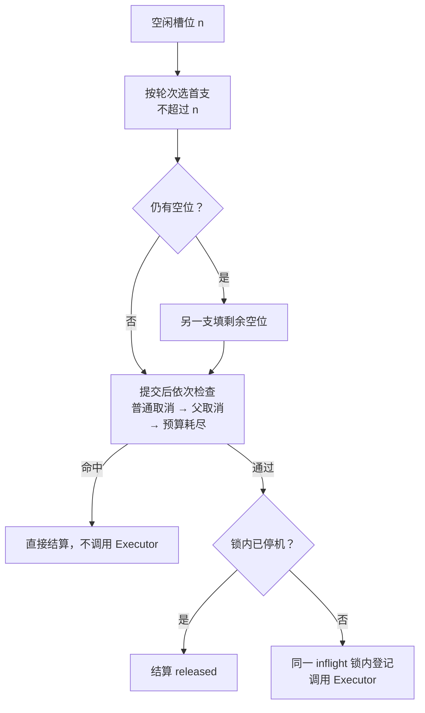

| 领取分支 | 原子写入 |
|---|---|
| pending：run_at ≤ now() | running、新 token / owner / 到期，started_at=now() |
| running：租约已过期 | 换租约与 started_at，attempt +1，追加 interrupted |

- 两支均 `SKIP LOCKED`，不预取；加锁后重判状态。新 token 拒绝旧持有者写入。
- 有空槽且有注册类型才计领取轮次，每 8 轮中第 8 轮先领过期 running，其余先领 pending；失败也推进轮次。另一支填剩余空位，共用本轮有界 ctx；时间未耗尽时首支失败仍尝试另一支，所有已提交领取都须派发。
- 过期候选按 `lease_expires_at, id` 排序，保持到期列不入索引。轮次保证领取机会，不承诺墙钟恢复上界；单行进展还依赖 DB 可用、槽位释放、该行可锁及更早候选有限。
- 重领用 `LEAST(attempt+1,32767)` 防止整批溢出；后续预算检查不再加 attempt / interrupted。
- 节点以独立 10s ctx 读取父 input / DAG / 直接前驱 output。被取消跳过的领取，提交后查父；回滚后由后来领取检查。

**准入必须原子化**：检查停机与登记共用 inflight 锁；登记赢，停机就看得见它；停机赢，就不执行。锁内不等待循环或执行器。

Executor 有独立 goroutine 与单次 deadline。库只 recover 这一个 goroutine 的 panic，保存栈并按失败重试；业务另起 goroutine 的 panic 可终止宿主。不能强杀未退出者，也不能提前释放其槽位。

### 2.3 心跳与租约失效

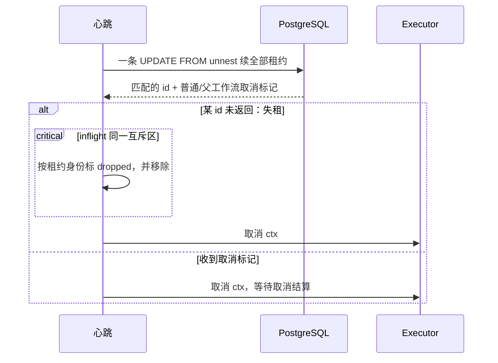

**续期上限**：`min(DB now()+LeaseTTL, started_at+timeout+CancelTimeout)`。

初始领取仍给 LeaseTTL，上限从首次心跳起生效。心跳只写 lease_expires_at，以 **id + token + running** 匹配；数据库不主动续期。

| 本地集合 | 身份与用途 |
|---|---|
| inflight | 按租约对象身份匹配；需要续租的租约 |
| active | 按 token 标识；仍活着的 Executor goroutine，决定槽位及 ErrNotDrained |

旧调用与本进程新接管调用可共享 run id，不能按 id 互相删除。

| 竞争 / 故障 | 必须做到 |
|---|---|
| Executor 返回 vs 失租 | 返回也在同一锁下移除、查 dropped；失租先赢则不上报，返回先赢仍须过 DB fence |
| 发布失租 | 不得“先移除、解锁，再标 dropped”，否则结果可穿过本地空隙 |
| 连续心跳失败 | 从最后成功心跳的**发起时刻**算单调期限；超过 LeaseTTL−HeartbeatInterval 就取消全部、丢结果 |
| 领取成功 | 不能刷新心跳期限：连得上 DB 不代表旧租约续上 |
| 不合作执行器 | ctx 结束再过 CancelTimeout，停止续租并告警；仍留 active 到真正退出，旧结果不得覆盖新持有者 |

心跳每 HeartbeatInterval 一次，单次 SQL 也受该间隔约束。使用独立 hbCtx；Shutdown 清空 inflight 后才取消它，不能被行锁拖过停机预算。

### 2.4 结算与工作流推进

**执行主线；未启动取消与 Resume 见 §2.5。**

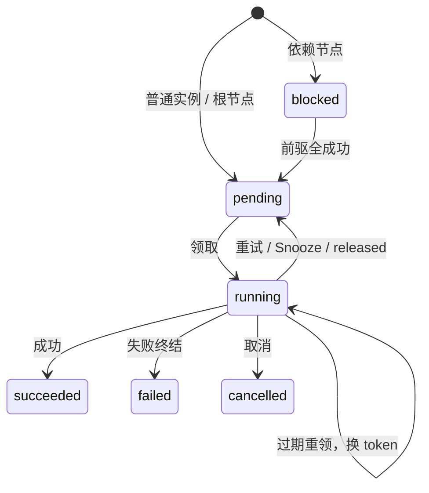

所有持租结果走 `Store.Settle`。节点先锁父行，普通实例只写自身；核心守卫是：

`id 匹配 AND lease_token 匹配 AND state='running'`

零行 → ErrLeaseLost → **整个事务回滚、丢结果、不重试陈旧写入**。所有出口清租约；只有终态写 finished_at。结算及传播的事件事实随事务结果返回，提交失败时全部丢弃（§3.5）。

| 结果 | 写入 | attempt / errors |
|---|---|---|
| succeeded | 保存 output，进入 succeeded | 不变 |
| cancelled | 进入 cancelled；有控制原因才记录 | 不加 attempt；按需追加 cancelled |
| snoozed | pending；run_at=DB now()+delay；params / output 原样 | 均不变 |
| released | pending；run_at=DB now() | attempt 不变，追加 released |
| failed | 可重试且 attempt+1 < max_attempts 则退避 pending，否则 failed | +1，追加原因 |
| 领取后预算耗尽 | failed；重领已经记录中断 | 不重复增加或记录 |

**取消守卫不能拆出 UPDATE**：重试、失败、Snooze、released、预算耗尽这五类出口，同语句检查 `cancel_requested OR wf_cancelling`。
命中则改为 cancelled、设置 finished_at；其它字段仍按该分支写入。父状态来自已锁父行，不用事务前的旧内存判断。

**节点推进与父行收敛，仍在同一事务内：**

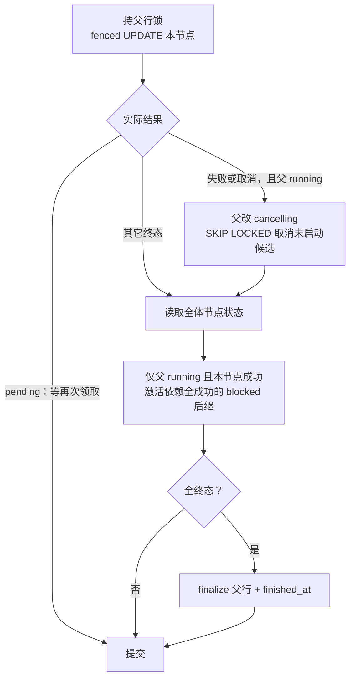

| 必要约束 | 为什么 |
|---|---|
| failed / cancelled 且父 running：先置父 cancelling | fail-fast；可锁候选记 upstream_failed / upstream_cancelled，在跑兄弟不批写 |
| **先写取消，再读状态** | 跳过的 pending / running 仍未完成，不能在内存中提前判终态 |
| 激活仍带 blocked 条件，run_at=now() | 并行前驱在父锁下串行，汇合只激活一次 |
| finalize：有 failed → failed；否则父 cancelling → cancelled；否则 succeeded | 只在全体终态时收敛，父无需另存 error |
| 中途崩溃 | 本节点、传播、父行结果一起回滚；未提交等重领，已提交响应丢失不重复上报 |

退避在失败结算时抽样并持久化，恢复不重抽：

`min(max, base×2^(n−1)) × U[1−jitter,1+jitter)`；n 为累计失败序号。错误分类与输出校验见 §3.2。

退避与轮询抖动计算超出 time.Duration 上限时饱和到上限，不得溢出为负时长；正时长的亚纳秒舍入至少保留 1ns。

### 2.5 取消与续跑

**普通取消：一条 UPDATE，以锁到的新版本决定动作。**

| 锁到的状态 | 动作 |
|---|---|
| 无父行的 pending | 直接 cancelled |
| 无父行的 running | 首次设置 cancel_requested，心跳送达 ctx；已经请求取消时不重复更新或通知 |
| 工作流节点 | 不接受单节点控制，走父工作流 |

不能拆成两条分别匹配 pending / running：并发领取或重排可能让两条都错过。

**工作流取消：**

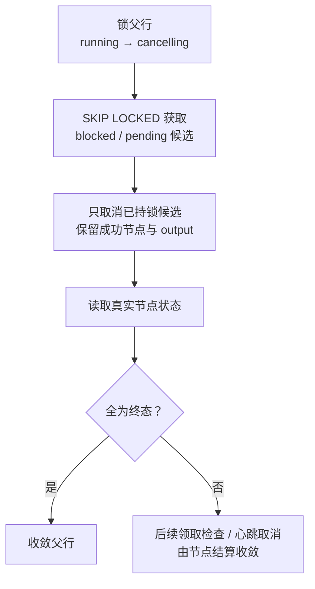

- 跳过的 pending 保留 run_at：当前领取提交后查父；回滚后等后来的兼容 Worker、到期与槽位。
- running 不批写；blocked 的库内修改都先锁父，不会被领取 / 心跳占锁而跳过。
- 重复取消 cancelling 父行幂等返回，不另起扫描；延后结算不补写批量取消的 upstream_failed。

**工作流 Resume：**

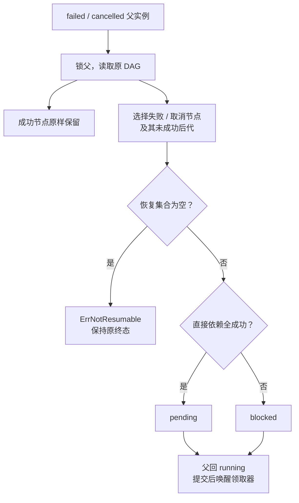

| Resume | 重置 / 保留 |
|---|---|
| 工作流重置集合 | attempt=0、run_at=DB now()；清 started_at / finished_at / output |
| 工作流空恢复集合 | cancelled 父可能全节点 succeeded；返回 ErrNotResumable，父子状态、时间和 output 不变，不通知 resumed |
| 普通 failed / cancelled | 条件 UPDATE → pending、run_at=now()、attempt=0；清租约、起止时间、output、cancel_requested |
| 两者共同保留 | 原 id、定义快照、errors、dedup_key 与业务幂等键；不读取新定义 |
| 重新占位冲突 | 用户键由原行持有，不自撞；计划拍遵循 §2.1 的当前规则和原唯一约束；冲突则**整个事务回滚**，不留部分重置 |
| 并发 / 零行 | 不重置已 pending / running 者；无锁分类不存在、节点、不可续跑状态（§3.3） |

Resume 只重置同一意图的执行预算；同一 run id 可再次进入终态。

计划拍先无锁读取不可变 schedule_name，再取得名称锁，随后锁父 / 普通行重判。不存在、节点、非终态及空恢复集合先按各自错误分类，再检查其它在途拍；非计划 Resume 保留原锁序。

### 2.6 启动与停机

**Start 不挡住 Shutdown，也不在 Shutdown 后补启动：**

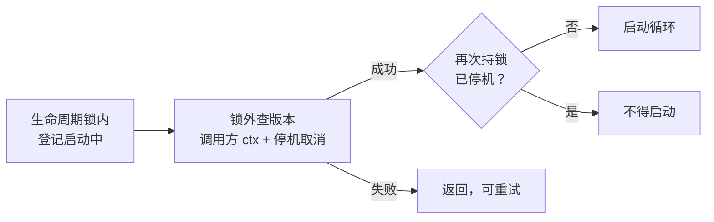

注册与循环启动也和停机串行；Shutdown 后不能重新 Start。启动不重置 running：有效租约照常，过期者走领取分支二；计划按持久到点补一拍。

**Shutdown 只执行一次：**

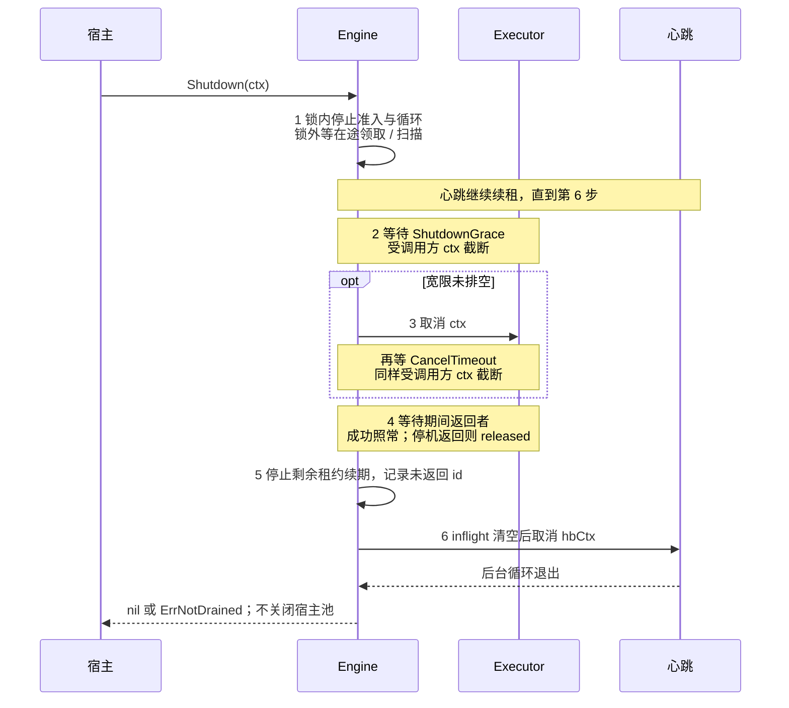

| 边界 | 约束 |
|---|---|
| 第 1 步 | inflight 锁与准入互斥；领到但未准入者 released。解锁后才等循环；Trigger / TriggerTx 仍可提交 |
| 第 4–5 步 | released 不加 attempt、保留历史；残留 Executor 留 active，不等其退出，租约到期可被接管 |
| 总预算 | 调用方预算 + 一个在途领取 / 扫描事务（≤10s）；两段执行器等待都不能另起完整宿主预算 |
| 后到的 Shutdown | 只等 shutDone 或自己的 ctx，不排队继承首个调用预算 |
| 资源归属 | Start 父 ctx 取消会发起 Shutdown；信号、os.Exit、连接池归宿主 |

| I/O / 收尾 | ctx 与停机方式 |
|---|---|
| 领取、扫描；节点执行前查询 | 独立有界 ctx，10s |
| 心跳 | 独立 hbCtx，单次 ≤HeartbeatInterval；第 6 步取消 |
| 结算 | 独立有界 ctx，不能被执行 ctx 取消掉 |
| 维护批次 | 跟随循环 ctx，停机取消，不额外等一轮 |
| 回滚、监听关闭、路径恢复、维护解锁 | 有界清理；回滚 / 恢复 / 解锁各有独立 5s 期限，不共享将耗尽的 deadline |

### 2.7 唤醒与时钟

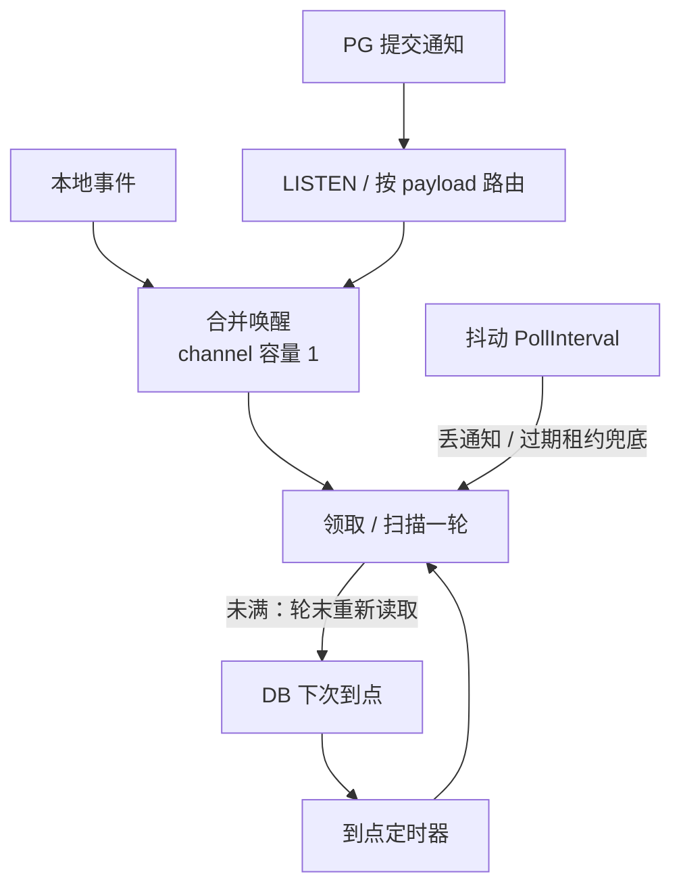

| 唤醒入口 | 领取器 | 扫描器 |
|---|---|---|
| 本地 | Trigger、扫描建 run、槽位释放、成功 Resume | Put / Delete |
| NOTIFY | 已注册类型的 `run:<executor_type>` | `schedule` |
| DB 到点 | 每类型最早 pending run_at，包含已到期行 | enabled 计划最早 next_run_at |

通知**只是少等一会儿，不是领取许可**。提交后才发、回滚不发，同事务同 payload 合并；实例醒来仍竞争 SKIP LOCKED，行可能已不可领。

| 触发器 | 通知条件 |
|---|---|
| job_run | INSERT 或 state / run_at UPDATE，且新状态 pending；未来到期也发，促使重算定时器 |
| 心跳 / 领取 | 不改触发列 / 新状态 running，因此不发 |
| schedule | INSERT、DELETE，或 SET 列表含 cron / timezone / enabled；值未变的 Put 也发 |
| 扫描推进 | 只改 next_run_at，不通知全体重扫 |
| 通道 / 长名称 | 通道=schema；executor_type >7000 字节用空 payload 广播唤醒两者，避开 PG 8000 字节限制 |

**等待只使用同一句返回的 DB 时间差：**

`到点等待 = max(next_due − db_now − 语句返回后的本地耗时, 20ms)`

`实际等待 = min(jitter(PollInterval), 到点等待)`；无 next_due 则只等抖动轮询。

- db_now 必须是 clock_timestamp()，不是事务起点 now()；本地时钟只扣经过时间，不与 DB 墙钟相减。本地采样点在语句返回之后、COMMIT 之前，提交往返也算进已过时间。到点分支不加抖动。
- 领取未满才在轮末逐类型探测 idx_job_run_claim；满轮靠释放槽位。已到期行保留，覆盖新到期 / 领取回滚。
- 扫描未满才在批末读推进后的到点；满 50 行立即再扫。长期候选行锁可能让到点分支按 20ms 重试。

**监听断线**：关闭连接 → 计 listener_reconnect_total → 等抖动轮询 → 重连；每次 LISTEN 成功立即唤醒启用的循环。
监听不持事务或行锁，只处理启用角色。丢通知、远端更早计划、租约过期都由轮询补足；租约过期没有专用到点定时器。

### 2.8 保留清理

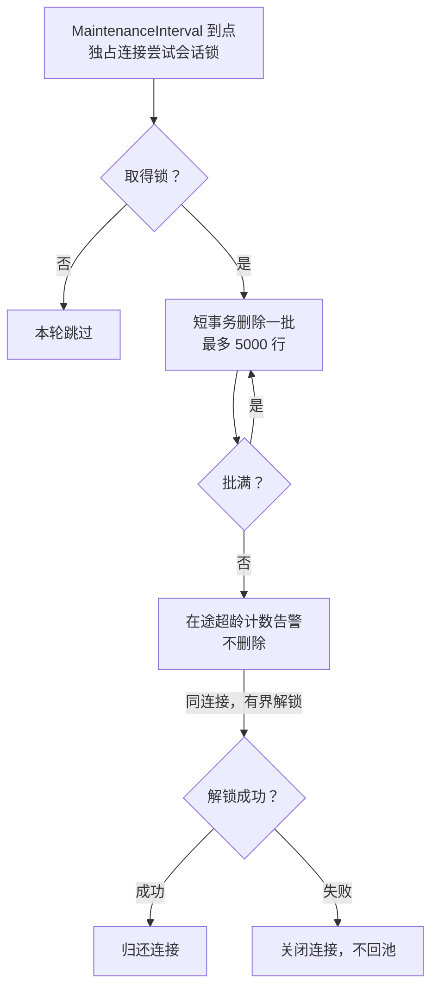

每步各自短事务，不能用整轮长事务压住 xmin、阻碍 HOT 剪枝。会话锁在数据库内共享，只减少争抢，不是删除正确性的来源，也不是选主。

| 清理守卫 | 必须做到 |
|---|---|
| 保留期 | 成功 / 失败与取消分别用配置窗口；finished_at 索引圈范围，state 在堆上过滤 |
| 普通实例 | 排除 workflow_run_id 非空者；节点随父实例级联，不能单独删前驱 |
| 子查询与外层 DELETE | **两处都带终态和保留期条件**；等锁后 PG 只重判外层，防止误删已 Resume 的工作流及节点 |
| 巡检 / 错误 | 只统计超龄工作流与普通 pending / running；每步失败记 error 和失败指标，不静默 |
| 停机 / 解锁 | 取消在途批次；解锁与回滚各自 5s。解锁失败关闭连接，防止会话锁带回池 |

客户端关闭不代表被行锁阻塞的后端已释放锁。

清理释放用户键与拍次唯一性（§2.1），不保证跨删除窗口的 exactly-once。键的保留时长取决于结果所用窗口；更长的业务幂等归宿主。

### 2.9 锁序与故障窗口

**合法锁序：计划名称锁 → 必要的 schedule 行锁 → workflow_run → job_run。** 非计划操作从其需要的行开始，不能反向取锁。

| 操作 | 行锁 |
|---|---|
| Put / Delete | 一个名称锁，再修改 schedule |
| 扫描 | 名称锁非阻塞尝试，再 SKIP LOCKED 锁单个 schedule；批次中取得更多名称锁时不等待 |
| 结算 / 取消工作流 / 推进 / Resume | 先父行，再节点；结算可等自己的节点，不等其它取消候选 |
| 领取 | 只锁候选 job_run，SKIP LOCKED |
| 心跳 | 可等本进程 running 行，不等父行锁 |
| 普通取消 | 只更新一行 |
| LISTEN / NOTIFY | 无这条行锁链；监听无事务，触发器只入队通知 |

计划拍 Resume 先取得其名称锁；结算、心跳、保留清理不取名称锁或 schedule 行锁。在途检查只读其它 run，新增 / 恢复同名拍已被名称锁串行；退出在途集合不需要该锁。扫描的跨名称非阻塞获取避免批次间等待环，也不能先批量锁计划行再等待名称锁。

**为什么不能直接批量 UPDATE 兄弟节点：**

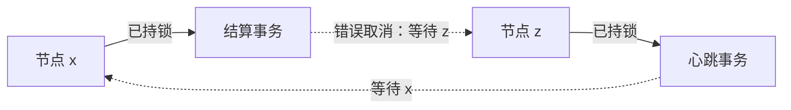

PG 可能**先锁新版本，再重判 WHERE**：旧快照里 pending 的 z 已变 running，谓词最终不命中也可能先等待，形成上图锁环。

- 取消必须先 `FOR UPDATE SKIP LOCKED` 取候选，外层只写已持锁行；不能靠 state 谓词“证明不等待”。
- blocked 不能被领取 / 心跳占锁，库内修改又先锁父；持父锁取消不会漏掉这种 blocked。
- 跳过的 pending / running 必须算未完成；父状态取消和 SKIP LOCKED 是安全条件，不是可选性能优化。

| 零行的三种底层意义 | 处理 |
|---|---|
| token + running fence 失败 | 回滚、丢结果、不重试、不上报 |
| 条件状态转换未发生 | 不重复推进；按 API 幂等返回或分类，不假造成功状态 |
| 去重 INSERT / SKIP LOCKED 空集 | 已占用、去重或无可锁候选；放弃或查找，不撤销已落定事实 |

| 故障窗口 | 恢复依据 |
|---|---|
| 提交未知 | 未提交回滚；已提交响应丢失走在途去重，不能直接当作未提交 |
| 领取后崩溃 | 租约到期重领，attempt +1；预算与 smallint 封顶限制反复中断 |
| 副作用完成、结算未提交 | 允许再次执行，业务幂等避免重复效果 |
| 结算 / 推进中途失败 | 一起回滚后重领；已提交响应丢失保留已提交状态，不重报旧结果 |
| 旧持有者恢复 / DB 中断 / 全部离线 | fence 与本地失租拦旧结果；兼容实例恢复后继续，物理调用仍可能重叠 |

## 3. 外部契约

### 3.1 注册、定义与输入

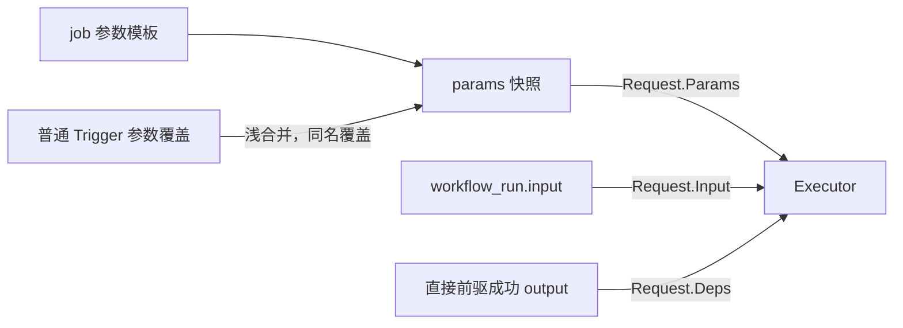

Register 在 Start 前完成；重复类型报错。泛型解码 params 为 P，失败不可重试。工作流先校验，再原子替换定义与节点，不能留下半张图。

Request 的可变引用不得改变内部结算身份；WorkflowRunId 提供独立副本，执行器修改请求不影响父行选择。

| 输入 | 校验 |
|---|---|
| 名字 | job / workflow / schedule / executor_type 非空、≤255 **字节**，限制去重键、错误引用与通知大小 |
| JSON | 每份输入 / 成功输出各受 MaxPayload 限制；params 模板与覆盖分别校验，浅合并结果可达两倍 |
| DAG | 非空、≤MaxNodes、job / deps 存在、无环；Deps 只暴露直接前驱 |
| cron | 5 字段或 @hourly 等描述符；有效 IANA Timezone；须有下一拍 |
| 拒绝的时间语法 | TZ= / CRON_TZ= 会覆盖 Timezone；@every 非绝对格点；Local 随宿主变化 |

**New 填默认后校验，不把非法值带进后台循环：**

| 配置 | 边界 |
|---|---|
| 周期、退避、宽限、保留时长 | >0 |
| Concurrency / MaxNodes / MaxPayload / ReleaseAlertThreshold | ≥1 |
| 关联时长 | LeaseTTL > HeartbeatInterval；BackoffMax ≥ BackoffBase；RetentionFailed ≥ RetentionSucceeded |
| DefaultTimeout / JobSpec.Timeout | 1s–2³¹−1 秒，避免 integer 秒溢出 |
| RetryPolicy | 仅整个零值取默认；部分填写照给定值校验。max_attempts=1–32767；base_sec / max_sec=0–30 天；jitter∈[0,1)，非 NaN |

Disabled 零值为启用，与两个 Disable 开关一致。公开 JSON 为 RawJSON（jsontext.Value）；签名与默认值见[源码](../README.md#源码导航)。

### 3.2 结果、错误与重试

**先过三道门：失租丢弃 → 已知取消请求取消 → err=nil 校验成功输出。其余非 nil 错误按下图分类。**

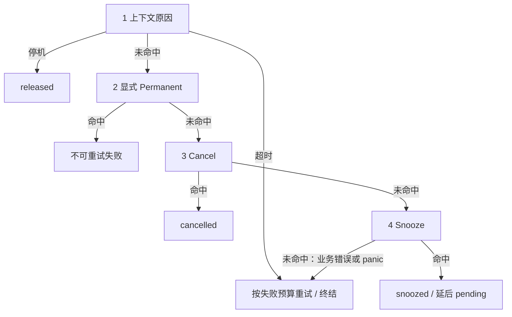

最终仍须过 **DB fence 与取消 CASE**（§2.4），不能把 Go 分类当作最终落库状态。

| 结果边界 | 契约 |
|---|---|
| 成功 output | nil / 非 nil 空值 → SQL NULL；非空须合法 JSON 且≤MaxPayload；无效或超限不可重试 |
| jsonb 确定性拒绝 | 任何结算遇 SQLSTATE 22（如 NUL / numeric 溢出），用 DB 原因改为不可重试失败，同租约再结算一次 |
| 错误记录 | 保存执行序号、时间、kind、原因；非法 UTF-8 / NUL 替换，截到 4KB；编码失败用固定文案 |
| Request.Attempt | 持久失败 / 中断计数 +1，不是总调用次数；计数变化见 §2.4–§2.5 |
| released 告警 | 累计达到 ReleaseAlertThreshold 告警，不能让反复滚动打断永远静默 |

Cancel 与 Snooze 都支持 `%w` 包装。

| 控制结果 | 行为 |
|---|---|
| Cancel(nil) | 返回 nil |
| Cancel(err) | 忽略 output，以 cancelled 记录原因；节点取消整个工作流 |
| 无原因的取消路径 | 不凭空追加 errors |
| Snooze(delay>0) | 正常结束、以后再调；忽略随带 output，即使该 output 无效也不做成功输出校验 |
| Snooze(delay≤0) | Permanent 参数错误 |

Snooze 重排同一实例，保留快照与去重键（§2.4）；等待不占槽位、goroutine 或心跳，不推进后继，无次数 / 总期限，不额外抖动或计 released 告警。

**延迟精度**：向上取整到微秒且不得溢出；24h 不是上限。Snooze 结算失败后的过期重领仍计中断。

ErrLeaseLost 仅内部使用；[公共错误](../errors.go) · [分类实现](../settle.go)。

### 3.3 提交、查询与控制接口

| 接口 | 不可省略的边界 |
|---|---|
| Trigger / TriggerTx | 提交与去重结果见 §2.1；TriggerTx 路径隔离见 §1.3 |
| Get / GetRun | 实例快照；工作流父与全部节点来自**同一语句快照**，不能拼出不同时点状态 |
| Find / FindRun | 按名称与用户 DedupKey 只读定位持有者：命中即撞键 Trigger 会返回的那一行，不看 state，不创建 run；未触发与已清理同为 ErrNotFound；计划拍的 sched 键不匹配 |
| 实例 Extra | 只读暴露库管理的元数据；JobRun.LeaseOwner 仍从 extra 映射为字符串，不开放任意元数据写入接口 |
| List | 名称 / 状态过滤、id DESC；上页最后 id 作游标，多读一行判断尾页，不用 created_at |
| Stats | 单 SQL 按 executor_type 聚合到期量、running、最老年龄与注册标记，返回 ByExecutor 和汇总；无注册类型传空数组，不传 NULL |
| Health | 不访问数据库的本进程快照，口径见 §3.5 |
| Delete | 被引用定义报 ErrReferenced；不存在按操作契约报 ErrNotFound |

Stats 的注册集合属于本实例，不是集群注册表；所有读取 / 分类也经过库事务，不能泄漏 search_path。

ByExecutor 只含有 pending / running 行的类型；未来 pending 不计到期量，blocked 与终态不参与。汇总取分类的和与最大年龄，未注册到期量只累加未注册类型；空库返回零总量和空分类。

| 控制结果 | 含义 |
|---|---|
| Cancel 成功 | 幂等控制，不代表 goroutine / 供应商任务已同步停止；普通 running 经下次心跳送达 |
| Runs.Cancel / Resume 节点 | 拒绝，走工作流控制；跳过未启动节点的收敛条件见 §2.5 |
| Resume 非法 / 不存在 | 非法 id 拒绝；不存在 ErrNotFound |
| Resume 不可恢复 | 非 failed / cancelled 或工作流恢复集合为空 → ErrNotResumable |
| Resume 去重冲突 | ErrDuplicate；触发条件与回滚见 §2.5 |

### 3.4 时间、幂等与能力边界

**外部异步任务：成功 output 连接 submit 与 poll，不增加运行中 checkpoint。**

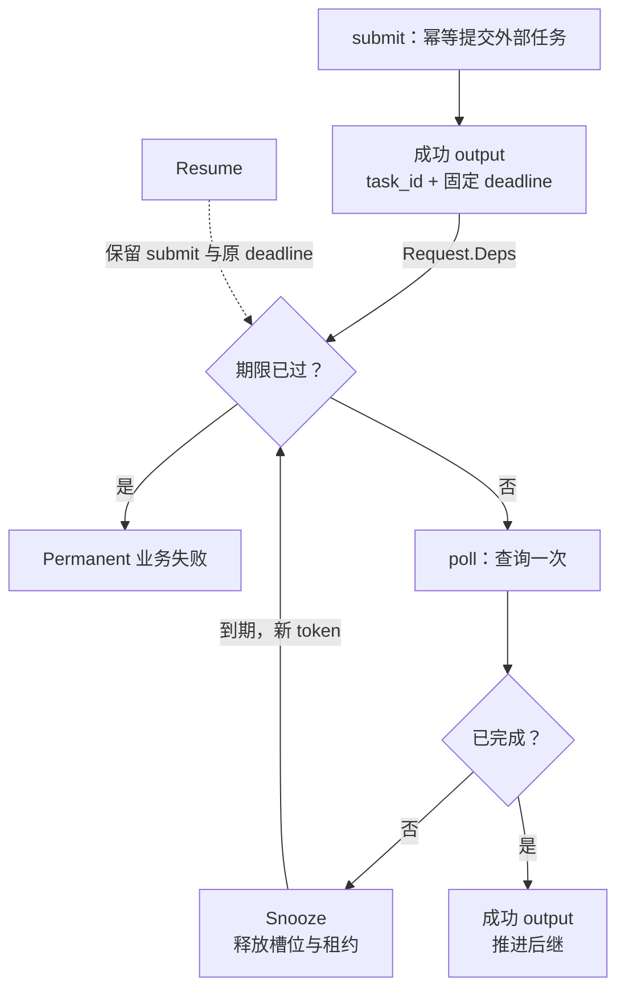

图示正常查询，查询错误按 §3.2 处理。

两节点是业务选择，不是 Snooze 前提。提交后未结算仍可崩溃：靠供应商幂等或稳定业务键找回，不能只缓存 task_id。固定期限与请求剩余预算用法见 [README](../README.md#外部长任务两节点--snooze)。

| 时间 / 身份 | 保证与不保证 |
|---|---|
| run_at | 可领取时刻，不承诺此时有空槽位 |
| timeout / max_attempts | 单次 ctx 期限 / 失败与中断预算；都不是工作流总历时或 Snooze 总期限 |
| token | DB 只认可一个持有者；不能阻止物理调用重叠，也不替外部资源 fencing |
| IdempotencyKey | 普通 `run:<id>`；节点 `wf:<workflow_run_id>/<job_name>`；跨 attempt / Resume 不变，业务据此去重 |
| ExecutionId | 由新 lease token 派生的非凭证标识，每次领取不同，即使 attempt 未增加或未调用 Executor；不保存独立执行历史 |
| 时钟 | DB 前跳 / 回拨可提前 / 延后接管；宿主仅用于单调耗时、ctx 与本地失租，不能代替 DB 驱动持久状态 |

| 能力边界 | 宿主责任 |
|---|---|
| 重复执行 | 过期接管、忽略 ctx、副作用后崩溃都可重叠；业务幂等，不承诺 exactly-once |
| 外部截止 / 取消 | Resume 不延长期限，重生成用 Trigger；取消不自动 Abort / 补偿。全部 Worker 或 PG 离线，只能恢复后检查超期 |
| 耐久性 | 假设 synchronous_commit=on；关闭或异步复制切换可能丢已确认提交，备份容灾归宿主 |
| 执行器升级 | 快照不包含业务代码；不兼容语义用新 executor_type，让旧类型排空 |
| 容量 | 单工作流父锁串行、扫描 O(N)、受 MaxNodes 限制；跨工作流可并行。队列会膨胀，NOTIFY 提交受 PG 全局锁串行化影响 |

容量结论须带任务组成与连接预算，不能外推所有机器的吞吐上限。

### 3.5 日志与观测

日志：`log/slog → instance → run_id / job_name / attempt / execution_id`；有提交追踪时附带 `trace_id`。Request 提供 ExecutionId 与原提交 TraceId；跨重试用 RunId / WorkflowRunId 关联（§3.4）。

**追踪传播**：使用 OTel W3C TraceContext，存储位置见 §1.2。

| 入口 / 阶段 | 行为 |
|---|---|
| Trigger / TriggerTx | 只保存有效的 traceparent / tracestate；去重、重试、Snooze、released 与 Resume 均保留原提交 |
| Worker | 背景 ctx 恢复远端父上下文，附加本次取消与超时；不继承请求取消、deadline、baggage 或其它 ctx 值 |
| 无有效提交追踪 / Cron | 不保存传播字段、不生成 trace |

库不创建 span；恢复的 Span ID 只代表原提交。宿主创建本次 span（或新 trace 加 link），配置 SDK / exporter；工作流节点共享提交来源，不推导前驱 links。

**提交后 Observer**：Store 在原事务内从 UPDATE 返回行收集事实，root 在 Commit 成功后、事务和内部锁外调用可选的 Config.Observer。提交失败、失租、幂等空操作不通知；不持久化事件或创建通知任务。

| 变化 | 事件语义 |
|---|---|
| 执行结算 | 按实际状态区分成功、重试、Snooze、释放、最终失败和取消；取消守卫命中只报 cancelled |
| 普通 Cancel / Resume | pending 取消、running 首次取消请求、恢复成功分别通知 |
| 过期接管 | reclaimed 关联新持有者，不作为旧执行失败 |
| 工作流取消与传播 | 通知实际取消的未启动节点、父首次 cancelling 及父终态 |
| 工作流 Resume | 通知实际重置节点和父恢复，保留成功节点 |
| 不通知 | 创建、普通领取、依赖激活、心跳、保留删除 |

同事务中父先 cancelling 后终态，只通知终态，原因取全部节点的聚合结果。

字段与事件类型见 [observer.go](../observer.go)。EventId 是随机通知标识；ExecutionId 关联结算、接管或取消请求的租约，未执行节点、Resume 和父事件为空。Duration 只计 Executor 调用耗时，其余为零；事件不暴露 token 或 payload。

回调 ctx 独立恢复追踪，不继承提交或执行的取消与 deadline；回收节点读父输入失败时仍可通知接管，追踪允许为空。执行前的接管通知须先登记租约，回调后重查取消与失租。

回调同步、可并发，逐次隔离并记录 panic；慢回调会阻塞槽位释放或控制 API，异步处理归宿主。尽力通知，无投递重试；提交后崩溃可漏报，回调时状态可能已变，不保证全局顺序，仍需查询与巡检。

Config.Metrics 被执行 goroutine 与循环并发调用，宿主实现须并发安全、不阻塞。[指标名称](../metrics.go)

**本地健康快照**：Health 复用现有循环记录进展；生命周期区分 new / starting / running / stopping / stopped，查版本期间为 starting，stopped 表示 Shutdown 已返回，仍可能残留执行器（§2.6）。

| 快照 | 口径 |
|---|---|
| 实例与角色 | 本进程标识及 Worker / Scheduler 配置 |
| Concurrency / SlotsUsed / Leases | 槽位容量 / 占用量 / 续租数；槽位含准备、Executor、结算及 Observer，可大于续租数 |
| Claim / Heartbeat / Scan | LastTick 含空转；LastSuccess 只计完整 DB 轮次成功并清空错误，空转保留结果 |

各循环每轮失败只累加一次 ConsecutiveErrors、更新 LastError。领取轮次含两支领取与到点查询，失败仍派发已提交的领取。空领取、空扫描、跳拍或禁用无下一拍算成功；停机取消心跳不改变结果。宿主时刻只供观测，不参与持久状态或 lastOK 失租判断。

快照只在短锁内复制，不持 lifecycle 锁，不嵌套健康锁与 inflight 锁，也不执行回调；各项独立采样。宿主结合角色、积压和预期周期判断健康。

| 观测值 | 口径 |
|---|---|
| claim_latency / schedule_lag | 领取 DB now()−run_at / 扫描相对 scheduled_at 延迟；都不是 Executor 入口，混合负载包含排队 |
| exec_duration | 标签取实际结算状态；pending 的 Snooze / released 各用 snoozed / released，取消命中用 cancelled |
| 恢复与退化 | lease_lost、reclaim、监听重连、released、清理失败；schedule_skipped 区分重叠 / 无下一拍 |
| 积压与超龄 | pending_due / pending_oldest_age / unregistered_due 来自 Stats；stale_active 只告警，不删除 |
| hot_update_ratio | 宿主读 pg_stat_user_tables；包含所有 UPDATE，不等于单独心跳比例，按同负载比较 |

验收见 [README](../README.md#验证判据)，测量口径与实测见 [baseline](baseline.md)、[scenarios](scenarios.md)。
